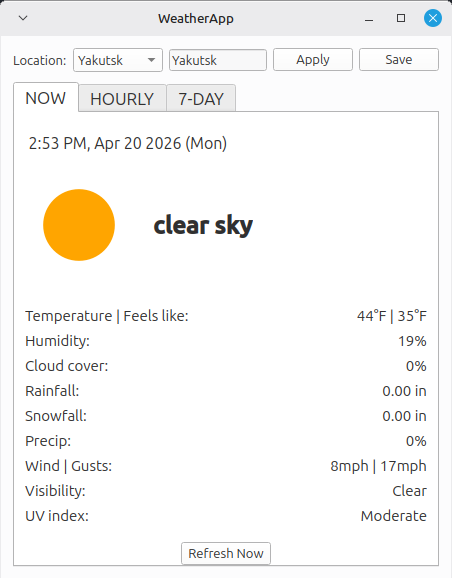
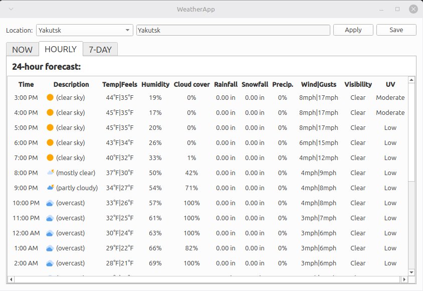
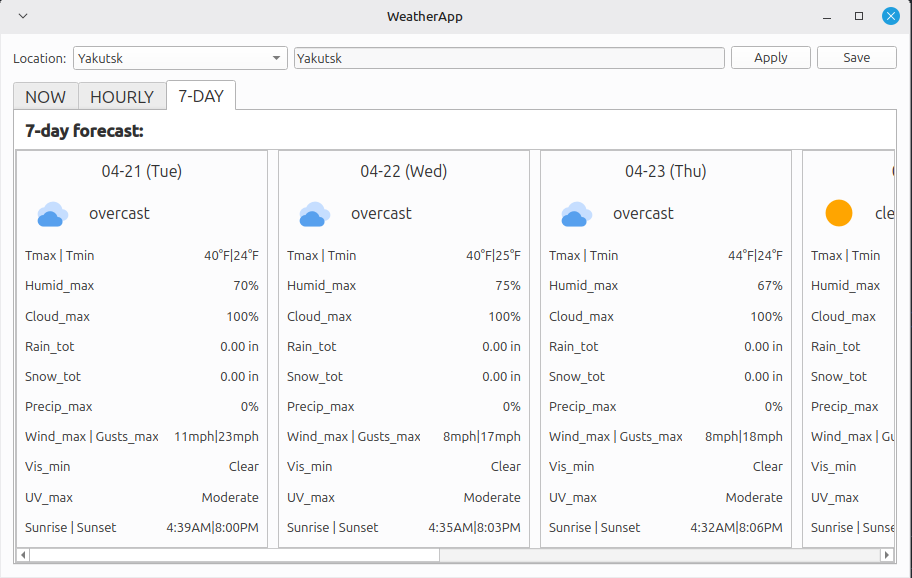

# WeatherApp

WeatherApp is a lightweight desktop weather application written in Python using PyQt6. It retrieves weather data from the Open-Meteo API and displays current conditions, a 24-hour hourly forecast, and a 7-day forecast in a simple, responsive desktop UI.

## Features

- Current weather conditions
- 24-hour hourly forecast
- 7-day forecast
- Clean PyQt6 desktop interface
- Minimal dependencies and fast startup
- Background worker threads to keep the UI responsive

## Screenshots

### Current Conditions



### 24-Hour Forecast



### 7-Day Forecast



## Requirements

- Python 3.12 or newer
- Poetry (for dependency management)
- PyQt6 (installed via Poetry)

### Linux note

Qt6 on many Linux distributions requires the libxcb-cursor library. On Debian/Ubuntu/Mint systems install:

```bash
sudo apt update
sudo apt install libxcb-cursor0
```

## Installation

Clone the repository and install dependencies using Poetry:

```bash
git clone https://github.com/Quantiux/weatherapp.git
cd weatherapp
poetry install
```

## Running the application

Start the application with:

```bash
poetry run python -m weatherapp.app
```

This launches the PyQt6 desktop interface and retrieves the latest weather data from the local machine.

## Data source

Weather data is provided by the Open-Meteo API. Open-Meteo provides free weather forecasts and does not require an API key for the data used by this application.

## Project structure (brief)

- src/weatherapp: application source code
  - gui: PyQt6 UI and worker threads
  - data: weather data fetching
  - format: formatting utilities for display
  - utils: small helper modules and mappers
- docs/screenshots: example screenshots used in this README

## Future improvements

Planned or suggested enhancements:

- Add weather icons and improved visual styling
- System tray integration for quick status
- Location auto-detection
- Radar map or interactive map overlay

## License

MIT License
